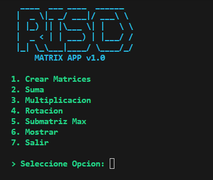

# RISC Matrix App

[](https://github.com/Geovanni-Gonzalez/RISCMatrixApp/actions/workflows/ci.yml)

## Descripción
Aplicación en ensamblador orientada a operaciones con matrices, organizada en memoria, macros, utilidades y lógica principal.

## Objetivo
Practicar bajo nivel, manejo de memoria y operaciones matriciales.

## Tecnologías utilizadas
- Assembly
- Makefile
- Bajo nivel
- Consola

## Funcionalidades principales
- Operaciones de matriz
- Gestión de memoria
- Macros/utilidades
- Makefile
- Archivos de prueba

## Mi rol
Implementé rutinas en ensamblador para operaciones y soporte.

## Aprendizajes clave
- Matrices en memoria
- Macros ASM
- Compilación modular
- Depuración bajo nivel

## Instalación y ejecución
El Makefile está preparado para ARMv7/Raspberry Pi y permite sobrescribir `AS` y `LD`.
```bash
cd RISCMatrixApp
make
./matrix_app
```
En WSL/x86 puede requerir toolchain cruzado:
```bash
make AS=arm-linux-gnueabihf-as LD=arm-linux-gnueabihf-ld
```

## Estructura del proyecto
- src/main.s: flujo
- src/matrix.s: matrices
- src/memory.s: memoria
- src/macros.s y utils.s: soporte
- Makefile: build

## Capturas o demo


## Estado del proyecto
Proyecto académico funcional según entorno.

## Valor técnico demostrado
Evidencia implementación de algoritmos sin abstracciones de alto nivel.

## Mejoras futuras
- Agregar guía de instalación del toolchain ARM
- Agregar ejemplos
- Separar objetos compilados

## Autor
Geovanni González  
Estudiante de Ingeniería en Computación  
GitHub: [Geovanni-Gonzalez](https://github.com/Geovanni-Gonzalez)


